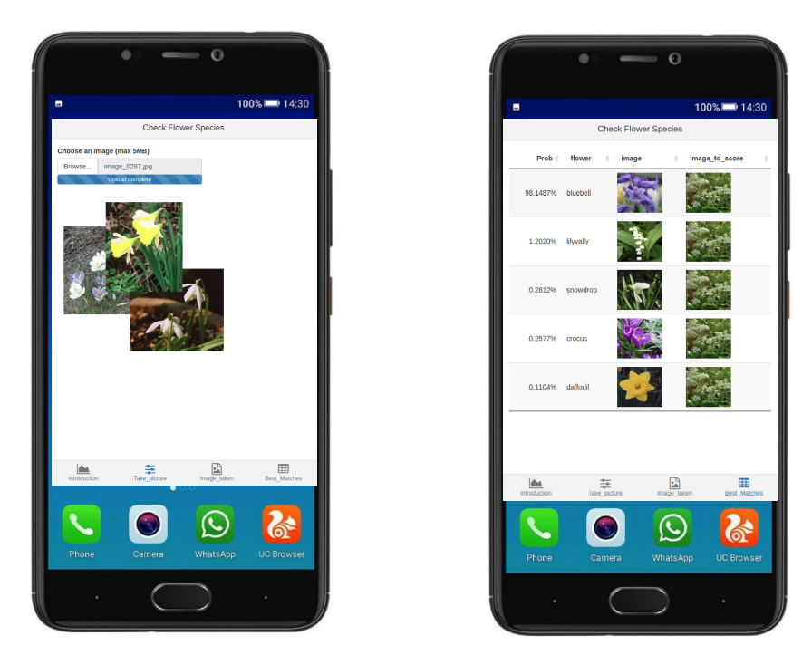

# flowermodel

shiny app to predict flower species.

First, a deeplearning model with PyTorch is created. A Resnet18 is finetuned on flower images from the Visual Geometry Group. See the Jupyter notebook for the complete python code.

Second, the model is saved as a *.pt file

Third, In R a shiny app is created that uses the reticulate package to use the pytorch model to score new uploaded flower images. The shiny app is created with miniUI so that it is mobile friendly.

